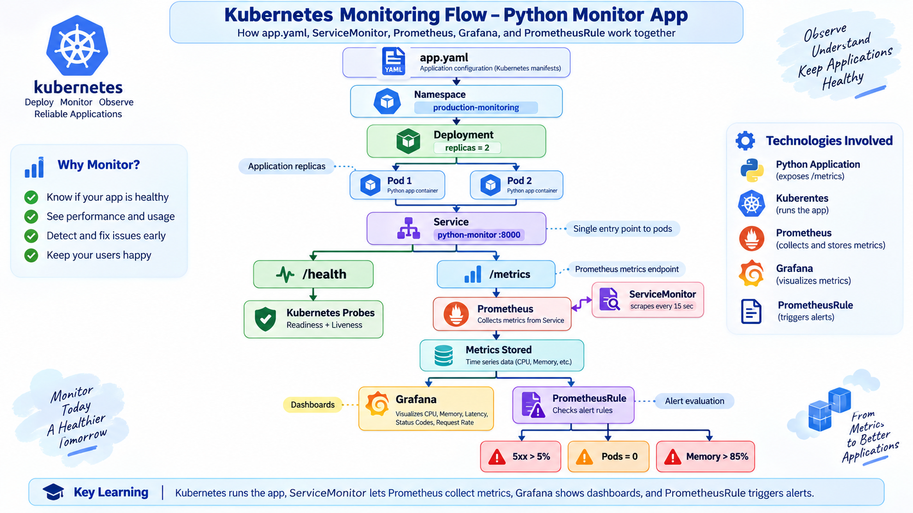
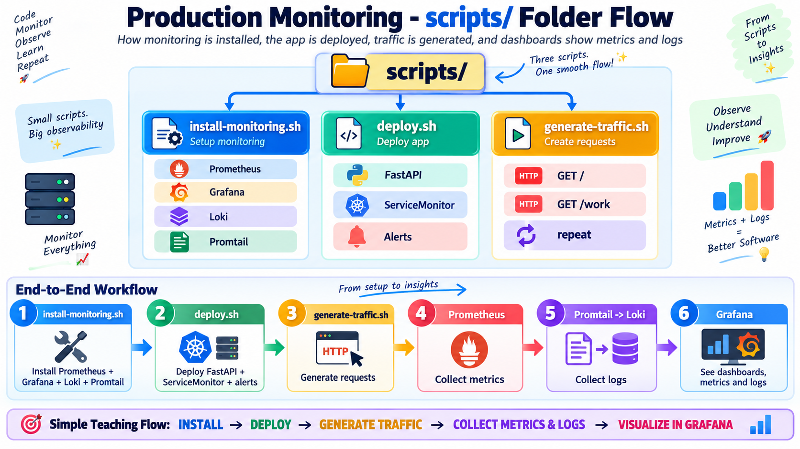

# Production Monitoring with Python and Kubernetes

A small FastAPI application monitored with **Prometheus**, **Grafana**, **Loki**, and **Promtail**. The project covers application metrics, Kubernetes pod CPU and memory, centralized pod logs, a ready-to-use dashboard, and Prometheus alerts.

## Architecture

```text
Users -> FastAPI pods -> /metrics -> Prometheus -> Grafana dashboard
                         pod logs -> Promtail -> Loki -----^
Kubernetes/cAdvisor -> CPU + memory metrics -> Prometheus -^
```



The application runs as two Kubernetes pods behind a Service. Kubernetes checks
`/health`, while the `ServiceMonitor` instructs Prometheus to scrape `/metrics`
every 15 seconds. Grafana visualizes the collected metrics, and the
`PrometheusRule` evaluates the configured availability, error-rate, and memory
alerts. Promtail separately forwards pod logs to Loki for querying in Grafana.

## What is included

- FastAPI endpoints: `/`, `/health`, `/work`, `/error`, `/metrics`
- Prometheus request count, latency, in-progress, process CPU, and process memory metrics
- Request logging with method, path, status, and duration, plus explicit workload and error events
- Kubernetes Deployment with two replicas, health probes, resource requests/limits, and a restricted security context
- Prometheus `ServiceMonitor` and three alert rules
- Grafana dashboard for request rate, status codes, latency, CPU, memory, and logs
- Loki and Promtail configuration for centralized pod logs

## Application behavior

| Endpoint | Behavior |
| --- | --- |
| `GET /` | Returns the demo name and the `/docs` link. |
| `GET /health` | Returns `{"status":"healthy"}` and is used by both Kubernetes probes. |
| `GET /work` | Runs 40,000–100,000 square operations to create a small, randomized CPU load, logs the iteration count, and returns the result. |
| `GET /error` | Logs a demonstration error and deliberately returns HTTP 500. |
| `GET /metrics` | Refreshes process metrics and returns the Prometheus exposition format. It is hidden from the OpenAPI schema. |
| `GET /docs` | FastAPI's interactive OpenAPI documentation. |

Two HTTP middleware functions run on every request. One refreshes process CPU and RSS memory gauges. The other measures request duration, increments the in-progress gauge while the request is handled, records the final status code, and writes a request log containing method, path, status, and duration. The `/metrics` scrape itself is deliberately excluded from request count and latency metrics. Known FastAPI route templates are used as the `path` label to avoid creating a metric series for every concrete URL.

### Custom Prometheus metrics

| Metric | Type | Labels | Meaning |
| --- | --- | --- | --- |
| `app_http_requests_total` | Counter | `method`, `path`, `status` | Completed application requests. |
| `app_http_request_duration_seconds` | Histogram | `method`, `path` | Application request latency. |
| `app_http_requests_in_progress` | Gauge | none | Requests currently being handled. |
| `app_process_cpu_percent` | Gauge | none | CPU percentage reported by `psutil` for the API process. |
| `app_process_memory_bytes` | Gauge | none | Resident memory (RSS) for the API process. |

The Python Prometheus client also exposes its standard process, Python runtime, and garbage-collection metrics.

## Prerequisites

- Docker
- A Kubernetes cluster (Docker Desktop, Minikube, or Kind)
- `kubectl` and Helm 3
- Python 3.12+ for local development

## 1. Run and test locally

```bash
python3 -m venv .venv
source .venv/bin/activate
pip install -r requirements-dev.txt
make test
make run
```

Open <http://localhost:8000/docs> and <http://localhost:8000/metrics>.

Application log verbosity defaults to `INFO`. Override it with `LOG_LEVEL`, for example:

```bash
LOG_LEVEL=DEBUG make run
```

## 2. Build the image

```bash
make build
```

For Minikube, build in its Docker environment or run `minikube image load python-monitor:1.0.0`. For Kind, run `kind load docker-image python-monitor:1.0.0`. Docker Desktop Kubernetes can use the local image directly.

## 3. Install the monitoring stack

The three helper scripts form a simple end-to-end workflow: install the
monitoring stack, deploy the application and its monitoring resources, then
generate traffic so the dashboards and logs contain useful data.



```bash
chmod +x scripts/*.sh
make install-monitoring
```

The script installs these Helm releases in the `monitoring` namespace:

- `kube-prometheus-stack`: Prometheus, Grafana, Alertmanager, kube-state-metrics, and node-exporter
- `loki`: log storage in single-binary mode (development configuration)
- `promtail`: log collector on every Kubernetes node

Prometheus is configured with a 7-day retention limit, but this demo does not configure persistent storage for it. Loki runs as one development-oriented single-binary replica and stores data in an `emptyDir`. Consequently, monitoring history can be lost when the relevant pod is replaced. Grafana, Prometheus, Alertmanager, Loki, and the application are exposed as internal `ClusterIP` services; use the port-forward commands below to access them locally.

> Promtail is included because it is an assignment requirement. For a new long-lived production platform, evaluate Grafana Alloy because Promtail has entered its deprecation lifecycle.

## 4. Deploy the application

```bash
make deploy
kubectl get pods -n production-monitoring
```

Deployment applies the application namespace, Deployment, Service, `ServiceMonitor`, and `PrometheusRule`, then waits up to 180 seconds for the application rollout. The application has two replicas and uses these container settings:

- CPU request/limit: `50m` / `250m`
- Memory request/limit: `64Mi` / `256Mi`
- Readiness: `/health` every 5 seconds after a 3-second delay
- Liveness: `/health` every 10 seconds after a 10-second delay
- Non-root UID `10001`, no privilege escalation, all Linux capabilities dropped, and the runtime-default seccomp profile

The ServiceMonitor scrapes `/metrics` every 15 seconds. Its labels match the `monitoring` kube-prometheus-stack release.

## 5. Open the application and Grafana

Run these in separate terminals:

```bash
make port-forward-app
make port-forward-grafana
```

- Application: <http://localhost:8000>
- Grafana: <http://localhost:3000>
- Grafana login: `admin` / `admin` (change this outside a demo environment)

The provisioned dashboard is under **Dashboards → Python Application - Production Monitoring**.

## 6. Generate traffic and logs

In another terminal:

```bash
make traffic
```

The traffic script calls `/` and `/work` every 0.5 seconds until interrupted with `Ctrl+C`. It targets `http://localhost:8000` by default; override that with `APP_URL`, for example `APP_URL=http://example.test make traffic`.

Create some error traffic for the status-code graph and logs:

```bash
for i in {1..20}; do curl -s -o /dev/null http://localhost:8000/error; done
```

## Verify each requirement

```bash
# Application metrics
curl http://localhost:8000/metrics

# Live pod CPU and memory (requires metrics-server)
kubectl top pods -n production-monitoring

# Raw pod logs
kubectl logs -n production-monitoring -l app=python-monitor --tail=20

# Prometheus/Grafana/Loki/Promtail pods
kubectl get pods -n monitoring

# Bonus alert rules
kubectl get prometheusrule -n production-monitoring
```

The dashboard's CPU and memory panels get container metrics from the kubelet/cAdvisor Prometheus scrape. `kubectl top` is only an extra CLI check and is not required by Grafana.

## Alert behavior

The included rules alert when:

- HTTP 5xx responses exceed 5% for 2 minutes
- No application replica is available for 1 minute
- memory usage exceeds 85% of the configured container limit for 5 minutes

View them in Grafana under **Alerting**, or in Prometheus under **Alerts**. Notification delivery (email, Slack, etc.) requires an Alertmanager receiver and credentials, which are intentionally not committed.

## Useful troubleshooting

```bash
kubectl get servicemonitor,prometheusrule -n production-monitoring
kubectl describe servicemonitor python-monitor -n production-monitoring
kubectl logs -n monitoring -l app.kubernetes.io/name=promtail --tail=50
kubectl get svc -n monitoring
```

If application pods show `ImagePullBackOff`, load the locally built image into your cluster as described in step 2. If the log panel is empty, generate new requests and select the last 30 minutes in Grafana.

If `make deploy` reports that the `ServiceMonitor` or `PrometheusRule` kind does not exist, run `make install-monitoring` first so the Prometheus Operator custom resource definitions are installed.

## Remove the project from Kubernetes

Stop any active port-forward and traffic commands, then remove the application and Helm releases:

```bash
kubectl delete namespace production-monitoring
helm uninstall promtail -n monitoring
helm uninstall loki -n monitoring
helm uninstall monitoring -n monitoring
kubectl delete namespace monitoring
```

For a dedicated Kind cluster, deleting the cluster is sufficient instead:

```bash
kind delete cluster --name monitoring
```

## Suggested YouTube demonstration (5–7 minutes)

1. Explain observability as understanding a system through metrics, logs, and traces; this project implements metrics and logs.
2. Briefly show the Python instrumentation and `/metrics` output.
3. Show healthy application and monitoring pods with `kubectl get pods -A`.
4. Generate traffic and show request rate, latency, CPU, and memory changing live in Grafana.
5. Call `/error`, then show the HTTP 500 series and matching Loki logs.
6. Show the configured Prometheus alert rules.
7. End with the GitHub folder URL containing this README and all source files.

## Repository layout

```text
app/                         Python application
tests/                       Application tests
k8s/app.yaml                 Deployment and Service
k8s/monitoring/              ServiceMonitor and alerts
monitoring/                  Helm values and dashboard ConfigMap
scripts/                     Install, deploy, and traffic scripts
docs/images/                 Architecture and workflow diagrams used by this README
Dockerfile                   Application container image
Makefile                     Local, image, deployment, forwarding, and traffic commands
requirements.txt             Runtime dependencies (pinned)
requirements-dev.txt         Runtime plus test dependencies (pinned)
pyproject.toml               Pytest configuration
```

## Quick start from a clean machine (Kind)

Use these steps when Docker has no images, containers, or clusters yet.

**Option A: Only the app, no Docker needed**

```bash
python3 -m venv .venv
source .venv/bin/activate
pip install -r requirements-dev.txt
make test
make run    # http://localhost:8000/docs
```

**Option B: Full Kubernetes monitoring setup**

1. Install Helm:

   ```bash
   brew install helm
   ```

2. Optionally remove old kubectl contexts whose clusters no longer exist:

   ```bash
   kubectl config get-contexts
   kubectl config delete-context <old-context-name>
   ```

3. Create a Kind cluster (kubectl switches to it automatically):

   ```bash
   kind create cluster --name monitoring
   ```

4. Build the image and load it into the cluster:

   ```bash
   make build
   kind load docker-image python-monitor:1.0.0 --name monitoring
   ```

5. Install the monitoring stack and deploy the app:

   ```bash
   chmod +x scripts/*.sh
   make install-monitoring    # takes about 5-10 minutes
   make deploy
   kubectl get pods -A        # all pods should be Running
   ```

6. Run each command in its own terminal:

   ```bash
   make port-forward-app       # http://localhost:8000
   make port-forward-grafana   # http://localhost:3000 (admin / admin)
   make traffic                # generates traffic for the graphs
   ```

> The Kubernetes setup needs some memory. If pods stay `Pending`, give Docker Desktop at least 6 GB in **Settings → Resources**.
